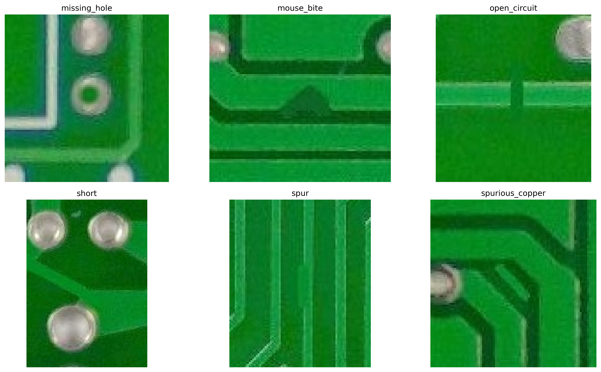
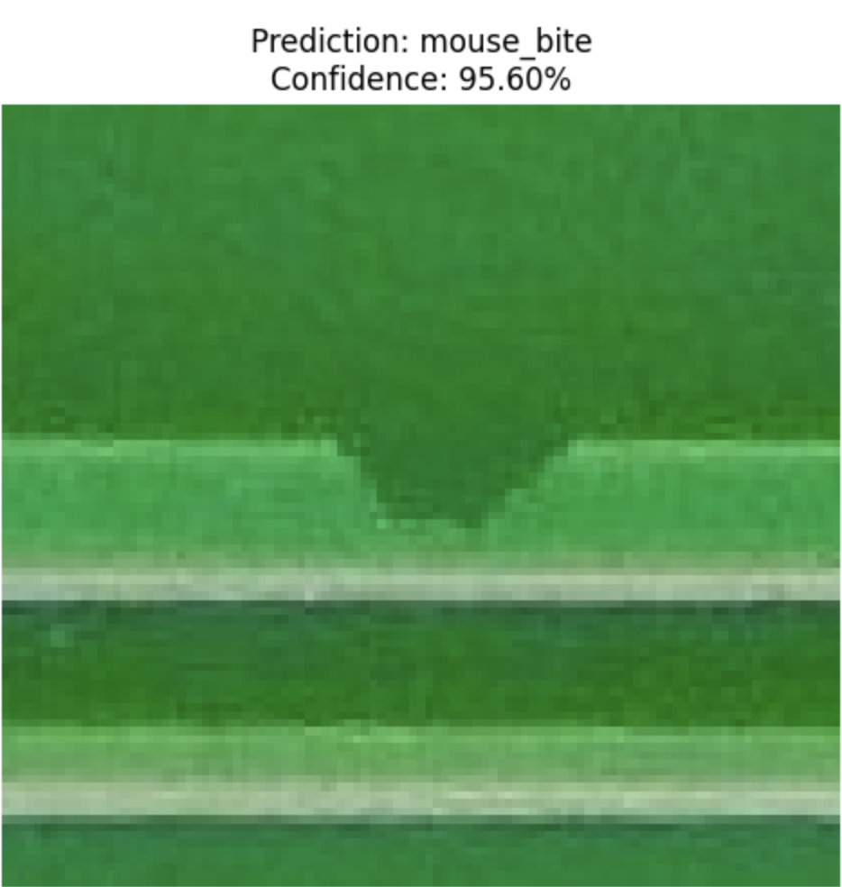

# 🔍 PCB Defect Detection Using CNN and Transfer Learning

> **Comparative Analysis of a Custom CNN and MobileNetV2 for Automated PCB Defect Classification**

---

## 📖 Project Overview

Printed Circuit Boards (PCBs) are critical components in modern electronic devices. Manufacturing defects such as missing holes, mouse bites, open circuits, shorts, spurs, and spurious copper can significantly affect product quality and reliability.

This project develops an automated PCB defect classification system using Deep Learning. A Custom CNN model is implemented as a baseline and compared against a MobileNetV2 Transfer Learning model to evaluate the effectiveness of transfer learning for industrial defect inspection.

### 🏆 Best Performing Model

**MobileNetV2**

| Model       | Accuracy |
| ----------- | -------- |
| Custom CNN  | 84.60%   |
| MobileNetV2 | 97.49%   |

---

## 📊 Dataset

The dataset consists of PCB defect images generated from YOLO-annotated PCB inspection data.

### Dataset Summary

| Dataset Split | Samples |
| ------------- | ------- |
| Train         | 12,991  |
| Validation    | 1,595   |
| Test          | 1,662   |
| Total         | 16,248  |

### Defect Classes

* Missing Hole
* Mouse Bite
* Open Circuit
* Short
* Spur
* Spurious Copper

### Sample PCB Defects



---

## 🧠 Methodology

The project follows the following workflow:

1. Data Preparation and Cleaning
2. Image Preprocessing and Augmentation
3. Custom CNN Development
4. MobileNetV2 Transfer Learning
5. Model Evaluation
6. Error Analysis
7. Prediction Confidence Analysis

### Custom CNN

* Three Convolutional Blocks
* Batch Normalization
* Max Pooling
* Dropout Regularization
* Softmax Classification Layer

### MobileNetV2

* Pre-trained ImageNet Weights
* Transfer Learning
* Fine-Tuning Strategy
* Global Average Pooling
* Dense Classification Head

---

## 📈 Results

### Model Performance Comparison

| Model       | Accuracy | Precision | Recall | F1-Score |
| ----------- | -------- | --------- | ------ | -------- |
| Custom CNN  | 84.60%   | 84.95%    | 84.60% | 84.69%   |
| MobileNetV2 | 97.49%   | 97.50%    | 97.49% | 97.49%   |

### Model Comparison


The MobileNetV2 model significantly outperformed the Custom CNN, demonstrating the effectiveness of transfer learning for PCB defect classification.

---

## 🔬 Explainability

Prediction confidence analysis was performed on unseen PCB defect images to evaluate model reliability.

### Example Prediction



The MobileNetV2 model correctly classified PCB defects with high confidence, providing additional evidence of robust feature learning.

---

## 📁 Repository Structure

```text
PCB-Defect-Detection-Using-CNN
│
├── README.md
├── requirements.txt
│
├── notebooks/
│   └── pcb-defect-detection-using-cnn.ipynb
│
├── figures/
│   ├── project figures and visualizations
│
├── data/
│   └── table_dataset_summary.csv
│
└── report/
```

---

## 🚀 How to Run

### Kaggle Notebook

1. Open the notebook.
2. Enable GPU acceleration.
3. Add the required datasets.
4. Run all cells.

### Local Environment

```bash
git clone https://github.com/your-username/PCB-Defect-Detection-Using-CNN.git

cd PCB-Defect-Detection-Using-CNN

pip install -r requirements.txt
```

---

## 🛠️ Technologies Used

* Python
* TensorFlow
* Keras
* NumPy
* Pandas
* Matplotlib
* Scikit-Learn
* OpenCV
* Kaggle

---

## 📌 Conclusion

This project demonstrates that Transfer Learning can significantly improve PCB defect classification performance compared to a CNN trained from scratch. MobileNetV2 achieved 97.49% classification accuracy and substantially reduced classification errors, making it a strong candidate for automated PCB inspection systems.

---

## 👨‍💻 Author

**Keshava Mani Dheekshith Reddy Naredla**

Machine Learning Project
