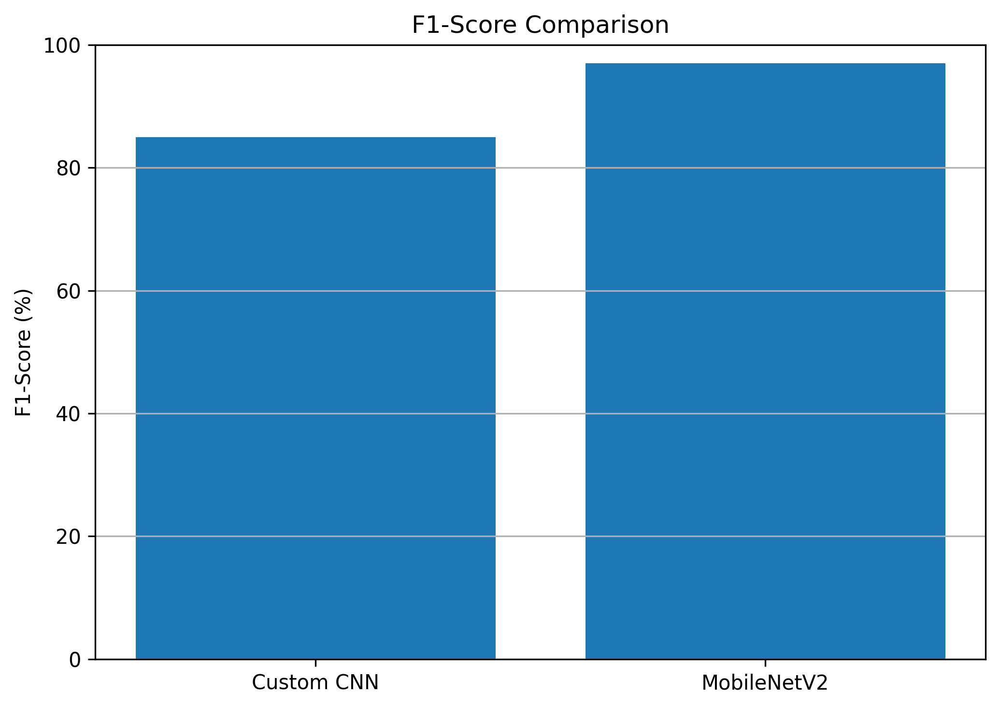
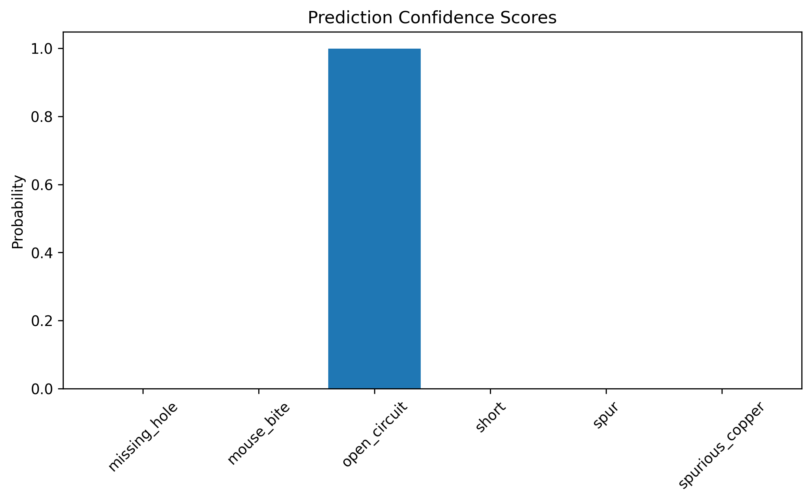

# PCB Defect Detection Using CNN and Transfer Learning

> **Comparative Analysis of a Custom CNN and MobileNetV2 for Automated PCB Defect Classification**

## Project Overview

Printed Circuit Boards (PCBs) are critical components in modern electronic systems. Defects introduced during the manufacturing process can significantly affect product quality, reliability, and performance. Manual inspection is time-consuming and prone to human error, motivating the need for automated inspection systems.

This project develops a deep learning-based PCB defect classification framework using image data. A custom Convolutional Neural Network (CNN) is implemented as a baseline model and compared with a MobileNetV2 transfer learning model. The objective is to evaluate the effectiveness of transfer learning for industrial defect classification and identify the most suitable model for automated PCB inspection.

**Best Performing Model:** MobileNetV2

---

## Project Information

| Property                | Details                               |
| ----------------------- | ------------------------------------- |
| Student                 | Keshava Mani Dheekshith Reddy Naredla |
| Course                  | Machine Learning                      |
| Instructor              | Prof. Raja Hashim Ali                 |
| Framework               | TensorFlow / Keras                    |
| Development Environment | Kaggle Notebook (GPU Enabled)         |
| Task                    | Multi-Class PCB Defect Classification |

---

## Dataset

The project uses a publicly available PCB defect dataset containing cropped defect images generated from annotated PCB inspection images.

### Dataset Statistics

| Dataset Split | Number of Samples |
| ------------- | ----------------- |
| Train         | 12,991            |
| Validation    | 1,595             |
| Test          | 1,662             |
| Total         | 16,248            |

### Defect Classes

1. Missing Hole
2. Mouse Bite
3. Open Circuit
4. Short
5. Spur
6. Spurious Copper

### Dataset Source

PCB Defect Dataset:

https://www.kaggle.com/datasets/fedybenhassouna/printed-circuit-board-pcb-defects

---

## Methodology

The project follows the following workflow:

### 1. Data Preparation

* Dataset loading and inspection
* Class distribution analysis
* Image resizing to 224 × 224 pixels
* Dataset splitting into training, validation, and testing sets

### 2. Data Augmentation

To improve model generalization, the following augmentation techniques were applied:

* Random rotation
* Horizontal flipping
* Vertical flipping
* Zooming
* Normalization

### 3. Custom CNN Model

A baseline Convolutional Neural Network was developed using:

* Convolution layers
* Max pooling layers
* Batch normalization
* Dropout regularization
* Dense classification layers

### 4. MobileNetV2 Transfer Learning Model

The transfer learning approach utilizes:

* Pre-trained MobileNetV2 backbone
* ImageNet weights
* Global Average Pooling
* Dense classification head
* Fine-tuning of selected layers

### 5. Model Evaluation

The models were evaluated using:

* Accuracy
* Precision
* Recall
* F1-Score
* Confusion Matrix
* Error Rate Analysis
* Prediction Confidence Analysis

---

## Results Summary

| Model       | Accuracy | Precision | Recall | F1-Score |
| ----------- | -------- | --------- | ------ | -------- |
| Custom CNN  | 84.60%   | 84.95%    | 84.60% | 84.69%   |
| MobileNetV2 | 97.49%   | 97.50%    | 97.49% | 97.49%   |

### Key Findings

* MobileNetV2 significantly outperformed the custom CNN model.
* Transfer learning improved classification performance by approximately 13%.
* MobileNetV2 achieved higher precision, recall, and F1-score across all classes.
* Error rates were substantially reduced using transfer learning.
* The model demonstrated strong performance for automated PCB defect inspection.

---

## Repository Structure

```text
PCB-Defect-Detection-Using-CNN
│
├── README.md
├── requirements.txt
│
├── notebooks/
│   └── pcb-defect-detection-using-cnn.ipynb
│
├── figures/
│   ├── figure_class_distribution.png
│   ├── figure_loaded_samples.png
│   ├── figure_sample_defects.png
│   ├── figure_5_1_cnn_accuracy_curve.png
│   ├── figure_5_2_cnn_loss_curve.png
│   ├── figure_5_2_cnn_confusion_matrix.png
│   ├── figure_6_1_mobilenet_accuracy.png
│   ├── figure_6_1_mobilenet_confusion_matrix.png
│   ├── figure_6_2_mobilenet_loss.png
│   ├── figure_7_1_model_comparison.png
│   ├── figure_7_2_f1_comparison.png
│   ├── figure_8_1_sample_image.png
│   ├── figure_8_2_prediction_result.png
│   ├── figure_8_3_prediction_confidence.png
│   ├── figure_9_1_error_rate_comparison.png
│   └── figure_10_1_final_accuracy_comparison.png
│
├── data/
│   └── table_dataset_summary.csv
│
└── report/
```

---

## Technologies Used

* Python
* TensorFlow
* Keras
* NumPy
* Pandas
* Matplotlib
* Scikit-learn
* OpenCV
* Kaggle

---

## How to Run

### Kaggle

1. Open the notebook in Kaggle.
2. Enable GPU acceleration.
3. Add the required datasets.
4. Run all notebook cells.

### Local Environment

```bash
git clone https://github.com/your-username/PCB-Defect-Detection-Using-CNN.git

cd PCB-Defect-Detection-Using-CNN

pip install -r requirements.txt
```

Run the notebook using Jupyter Notebook or Jupyter Lab.

---

## Visual Results

### Model Comparison


### F1-Score Comparison



### Final Accuracy Comparison


### Prediction Confidence Example



---

## Conclusion

This project demonstrates the effectiveness of deep learning for automated PCB defect classification. While the custom CNN achieved satisfactory performance, MobileNetV2 transfer learning significantly improved classification accuracy and robustness. The results highlight the benefits of leveraging pre-trained models for industrial quality inspection tasks and support the use of transfer learning in practical PCB manufacturing environments.

---

## Author

**Keshava Mani Dheekshith Reddy Naredla**

Machine Learning Project

University Coursework
